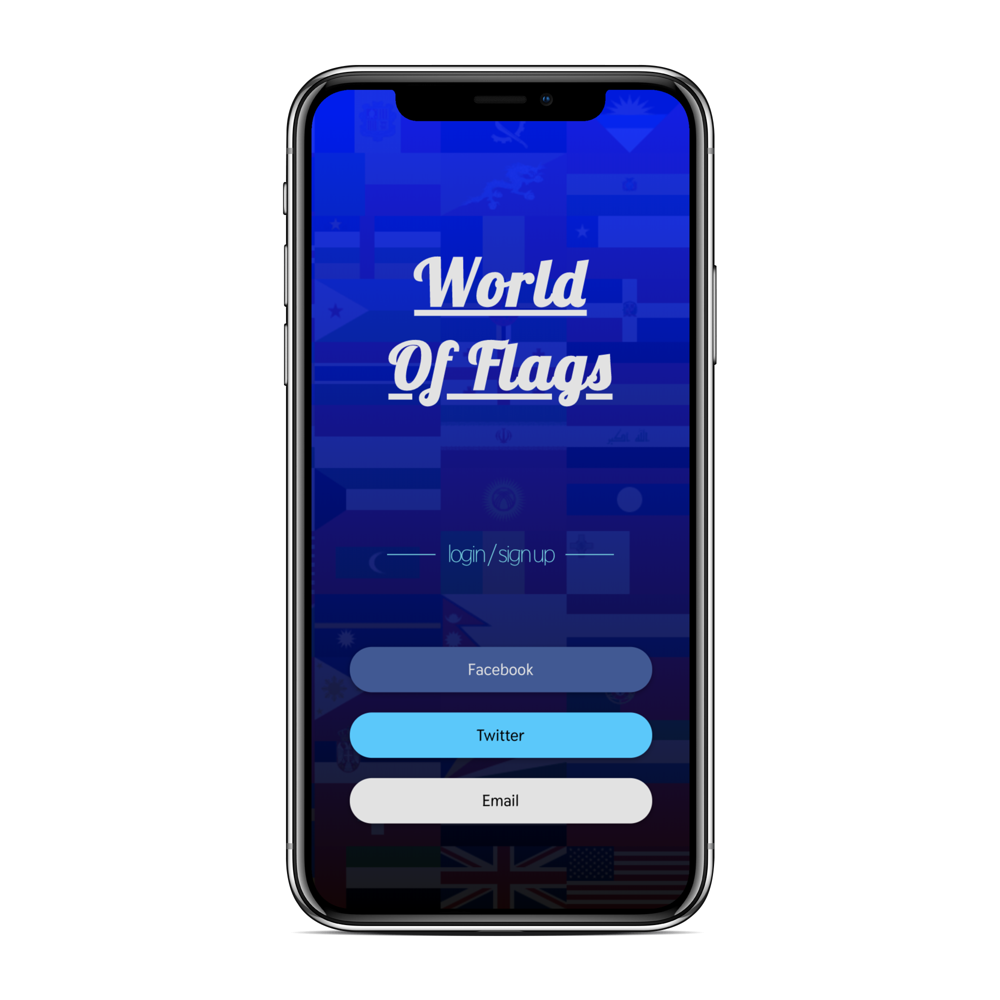

# World of Flags

## World of flags is a mobile app designed to help users teach themselves the flags of the world.  Its underlying goal is to stimulate users’ curiosity about the world by familiarizing them  with different countries’ flags.

When interacting with World of Flags, users are shown  a randomly generated  flag from one of the world’s 193 countries and then can choose between 4 country options.

If they get stuck, users can request up to 2 hints about the country whose flag they are guessing.  These hints consist of facts about the country or an image of the country’s outline.  By viewing these hints, users can grow to associate different flags with facts about their countries.

As users correctly guess different flags, they will accumulate points.  In this way, World of Flags aims to make learning about the world a fun and enjoyable process.

## Images:
### Main Game Page

### Landing Page

### Login Page

### Account Page

## How to Use
World of Flags on Heroku: [https://flagz4u-frontend.herokuapp.com/](https://flagz4u-frontend.herokuapp.com/).

### Developers:
#### Install and Start Server
* Clone this repo.

* `npm install`

* `npm start`

#### Create Postgres Database and Run Migrations:
* `psql CREATE DATABASE rechargeables`

* `knex migrate:latest`

* `knex seed:run`

## Technologies Used:
- React.js
- Redux
- React Router
- Sass
- Node.js
- Express
- Knex.js
- Heroku
- Travis CI

## Project Requirements:
Project spec can be found [here](http://frontend.turing.io/projects/capstone.html).

Project Trello board can be found [here](https://trello.com/b/ppUdNp6Q/cross-pollination-fe).

## This is a partenered project designed and coded by: 
Alex Bruce - [Github.com/Alexbruce1](https://github.com/Alexbruce1)
Alexander Ela - [Github.com/alexanderela](https://github.com/alexanderela)
Ben Hayek - [Github.com/benjaminhayek](https://github.com/benjaminhayek)
Tobin Nelson - [Github.com/Tobin-jn](https://github.com/Tobin-jn)
