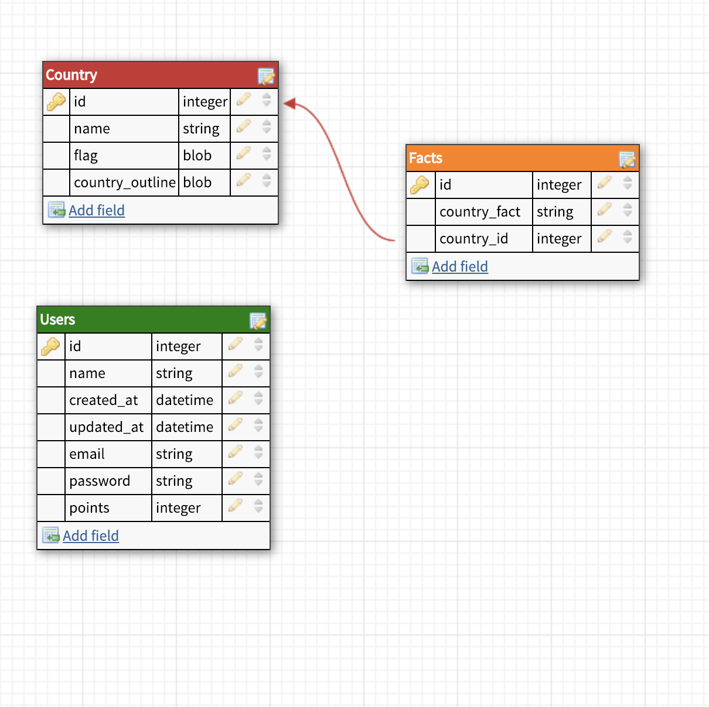

## DTR
[Group DTR]('assets/Cross_Pollination_DTR_Memo.md')

## GitHub Repos
* [Frontend Repo](https://github.com/alexanderela/cross_pollination_frontend)
* [Backend Repo](https://github.com/Tobin-jn/Flags-Backend)

## Trello SCRUM board with user stories
* [Frontend Trello](https://trello.com/b/ppUdNp6Q/cross-pollination-fe)
* [Backend Trello](https://trello.com/b/4U7aCk62/flagz4u-gang)

## Student Goals
* Ben Hayek: How to build a user profile/login in BE and to save their info.
* Tobin Nelson: How to build a user profile/login in BE and to save their info.
* Alex Bruce: Get more experience with seeing backend shite and get deeper understanding of it.
* Alex Ela: How to build a user profile/login in BE and to save their info.

## Git workflow
* Use rebase git workflow
* Use Leta's PR template

## MVP

##### General:
* Have image of random flag show up on screen
* Input for guessing choice
* Hint button:
* 1st hint is country fact
* 2nd hint is country outline
* Running tally of user's total points
* Individual user accounts
* Show answer button
* Point system
* Correct w/no hints = 3pts; w/1 hint = 2pts; w/2 hints = 1pt; 'skip' = 0pts
* 'New flag' button

##### Extension
* Leaderboard
* PWA
* Dropdown menu for country names

#### Backend Stack
* Express.js
* Knex.js
* Postgres Database

#### Frontend Stack
* React/Redux
* React Router
* Enzyme/Jest

### Schema

### Wireframe

